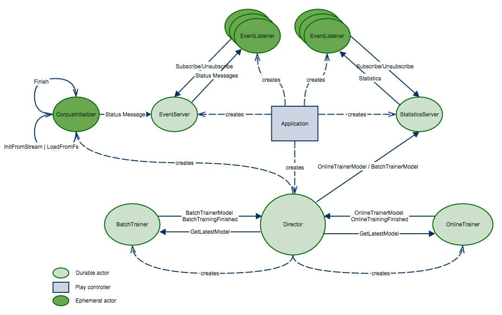

# Typesafe Activator tutorial for Apache Spark, MLlib, Scala, Akka and Play Framework

[](https://travis-ci.org/openforce/spark-mllib-scala-play/)

With this tutorial template we show how to automatically classify the sentiment of Twitter messages leveraging the Typesafe Stack and Apache Spark. These messages are classified as either positive or negative with respect to a query term. Users who want to research the sentiment of products before purchase, or companies that want to monitor the public sentiment of their brands can make use of this kind of application. The Activator template will consist of a backend component using Scala, Spark, Akka and the Play Framework in their most recent versions. The core part will demonstrate the usage of machine learning algorithms for classifying the sentiment of Twitter messages using Apache Spark and MLlib. The fundamental idea of sentiment classification used in this template is based on [the paper by Alec Go et al.](http://cs.stanford.edu/people/alecmgo/papers/TwitterDistantSupervision09.pdf ) and its related implementation [Sentiment140](http://www.sentiment140.com/).

## Setup Instructions

Assuming that you have [Java 8](http://www.oracle.com/technetwork/java/javase/downloads/jdk8-downloads-2133151.html) and [Sbt](http://www.scala-sbt.org/) already installed on your machine please do:

1. Clone this repository: `git clone git@github.com:openforce/spark-mllib-scala-play.git`
1. Change into the newly created directory: `cd spark-mllib-scala-play`
1. Insert your Twitter access token and consumer key/secret pairs in `application.conf`. For generating a token, please refer to [dev.twitter.com](https://dev.twitter.com/oauth/overview/application-owner-access-tokens).  By default the application runs in single-user-mode which means the access tokens configured in your application.conf respectively local.conf will be also used for querying Twitter by keywords. This is fine when you run the application locally and just want to checkout the tutorial. If you want to deploy it publicly you would have to turn single-user-mode off so that OAuth per user is used instead. To do so change the line in your ```conf/application.conf``` to ```twitter.single-user-mode = no```.
1. Launch SBT: `sbt run` or ACTIVATOR: `./activator ui` (If you want to start the application as Typesafe Activator Template)
1. Navigate your browser to: <http://localhost:9000>
1. If necessary change the twitter.redirect.url in application.conf to the url the application actually uses
1. If necessary (if twitter changes the url to its *fetch tweets service*) change the twitter.fetch.url in application.conf to the new one. Ensure that the last url parameter is the query string, the application will append the keyword at the end of the url.

If starting the application takes a very long time or even times out it may be due to a known [Activator issue](https://github.com/typesafehub/activator/issues/1036).
In that case do the following before starting with `sbt run`.

1. Delete the `project/sbt-fork-run.sbt` file
1. Remove the line `fork in run := true` (added automatically when you start activator) from the bottom of `build.sbt`

Without the fork option, which is needed by Activator the application should start within a few seconds.


## The Classification Workflow

The following diagram shows how the actor communication workflow for classification looks like:


The __Application__ controller serves HTTP requests from the client/browser and obtains `ActorRefs` for `EventServer`, `StatisticsServer` and `Director`.

The __Director__ is the root of the Actor hierarchy, which creates all other durable (long lived) actors except `StatisticsServer` and `EventServer`. Besides supervision of the child actors it builds the bridge between Playframework and Akka by handing over the `Classifier` `ActorRefs` to the controller. Moreover, when trainings of the estimators within `BatchTrainer` and `OnlineTrainer` are finished, this actor passes the latest Machine Learning models to the `StatisticsServer` (see Figure below). For the `OnlineTrainer` statistics generation is scheduled every 5 seconds.


The __Classifier__ creates a `FetchResponseHandler` actor and tells the `TwitterHandler` with a `Fetch` message (and the `ActorRef` of the `FetchResponseHandler`) to get the latest Tweets by a given keyword or query.

Once the __TwitterHandler__ has fetched some Tweets, the `FetchResponse` is sent to the `FetchResponseHandler`.

The __FetchResponseHandler__ creates a `TrainingModelResponseHandler` actor and tells the `BatchTrainer` and `OnlineTrainer` to pass the latest model to `TrainingResponseHandler`. It registers itself as a monitor for `TrainingResponseHandler` and when this actor terminates it stops itself as well.

The __TrainingModelResponseHandler__ collects the models and vectorized Tweets makes predictions and sends the results to the original sender (the `Application` controller). The original sender is passed through the ephemeral (short lived) actors, indicated by the yellow dotted line in the figure above.

## Model Training and Statistics

The following diagram shows the actors involved in training the machine learning estimators and serving statistics about their predictive performance:



The __BatchTrainer__ receives a `Train` message as soon as a corpus (a collection of labeled Tweets) has been initialized. This corpus is initialized by the __CorpusInitializer__ and can either be created on-the-fly via Sparks `TwitterUtils.createStream` (with automatic labeling by using emoticons ":)" and ":(") or a static corpus provided by [Sentiment140](http://www.sentiment140.com/) which is read from a CSV file. Which one to choose can be configured via `ml.corpus.initialization.streamed` in `application.conf`. For batch training we use the high-level `org.apache.spark.ml` API. We use _Grid Search Cross Validation_ to get the best hyperparameters for our `LogisticRegression` model.

The __OnlineTrainer__ receives a `Train` message with a corpus (an `RDD[Tweet]`) upon successful initialization just like the `BatchTrainer`. For the online learning approach we use the experimental `StreamingLogisticRegressionWithSGD` estimator which, as the name implies, uses _Stochastic Gradient Descent_ to update the model continually on each Mini-Batch (RDD) of the `DStream` created via `TwitterUtils.createStream`.

The __StatisticsServer__ receives `{Online,Batch}TrainerModel` messages and creates performance metrics like _Accuracy_, _Area under the ROC Curve_ and so forth which in turn are forwarded to the subscribed `EventListener`s and finally sent to the client (browser) via _Web Socket_.

The __EventListener__ s are created for each client via the Playframeworks built-in `WebSocket.acceptWithActor`. `EventListener`s subscribe for `EventServer` and `StatisticsServer`. When the connections terminate (e.g. browser window is closed) the respective `EventListener` shuts down and unsubscribes from `EventServer` and/or `StatisticsServer` via `postStop()`.

The __EventServer__ is created by the `Application` controller and forwards event messages (progress of corpus initialization) to the client (also via _Web Socket_).
