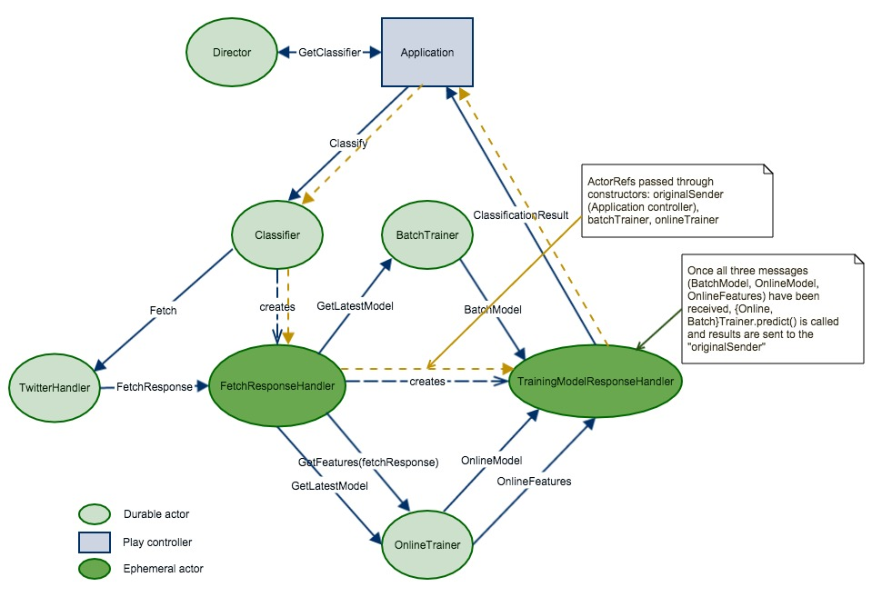

# Typesafe Activator tutorial for Apache Spark, MLlib, Scala, Akka and Play Framework

With this tutorial template we show how to automatically classify the sentiment of Twitter messages leveraging the Typesafe Stack and Apache Spark. These messages are classified as either positive or negative with respect to a query term. Users who want to research the sentiment of products before purchase, or companies that want to monitor the public sentiment of their brands can make use of this kind of application. The Activator template will consist of a backend component using Scala, Spark, Akka and the Play Framework in their most recent versions. The core part will demonstrate the usage of machine learning algorithms for classifying the sentiment of Twitter messages using Apache Spark and MLlib. The fundamental idea of sentiment classification used in this template is based on [the paper by Alec Go et al.](http://cs.stanford.edu/people/alecmgo/papers/TwitterDistantSupervision09.pdf ) and its related implementation [Sentiment140](http://www.sentiment140.com/).

## Setup Instructions

Assuming that you have [Java 8](http://www.oracle.com/technetwork/java/javase/downloads/jdk8-downloads-2133151.html) and [Sbt](http://www.scala-sbt.org/) already installed on your machine please do:

1. Clone this repository: `git clone git@github.com:openforce/spark-mllib-scala-play.git`
1. Change into the newly created directory: `cd spark-mllib-scala-play`
1. Insert your Twitter access and consumer key/token pairs in `application.conf`. For generating a token, please refer to [dev.twitter.com](https://dev.twitter.com/oauth/overview/application-owner-access-tokens).
1. Launch SBT: `sbt run`
1. Navigate your browser to: <http://localhost:9000>

## The Classification Workflow

The following diagram shows how the actor communication workflow for classification looks like:

The __Application__ controller serves HTTP requests and instatiates _EventServer_, _StatisticsServer_ and _Director_.

The _Director_ is the root of the Actor hierarchy, which creates all other durable (long lived) child actors. Besides supervision of the child actors it builds the bridge between the Playframework and Akka worlds by handing over the _Classifier_ actor reference to the controllers. Moreover, when trainings of the estimators within _BatchTrainer_ and _OnlineTrainer_ are finished, this actor pass the latest Machine Learning models to the _StatisticsServer_ (see Figure 2.).

The __Classifier__ creates a _FetchResponseHandler_ actor and tells the _TwitterHandler_ with a `Fetch` message (and the `ActorRef` of the _FetchResponseHandler_) to get the latest Tweets by a given token or query.

Once the __TwitterHandler__ has fetched some Tweets, the `FetchResponse` is sent to the _FetchResponseHandler_.

The __FetchResponseHandler__ creates a _TrainingModelResponseHandler_ and tells the _BatchTrainer_ and _OnlineTrainer_ to pass the latest model to _TrainingResponseHandler_. It registers itself as a monitor for _TrainingResponseHandler_ and when this actor terminates it stops itself as well.

The __TrainingModelResponseHandler__ collects the models and vectorized Tweets makes predictions and send the results to the original sender (the _Application_ controller).

## Model Training and Statistics

The following diagram shows the actors involved in training the machine learning estimators and serving statistics about their predictive performance:

### BatchTrainer

### OnlineTrainer

### EventServer

### StatisticsServer
